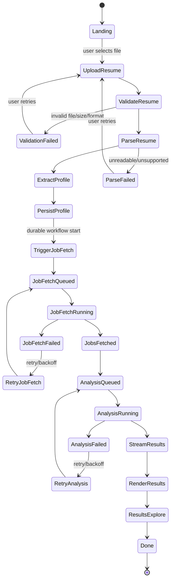
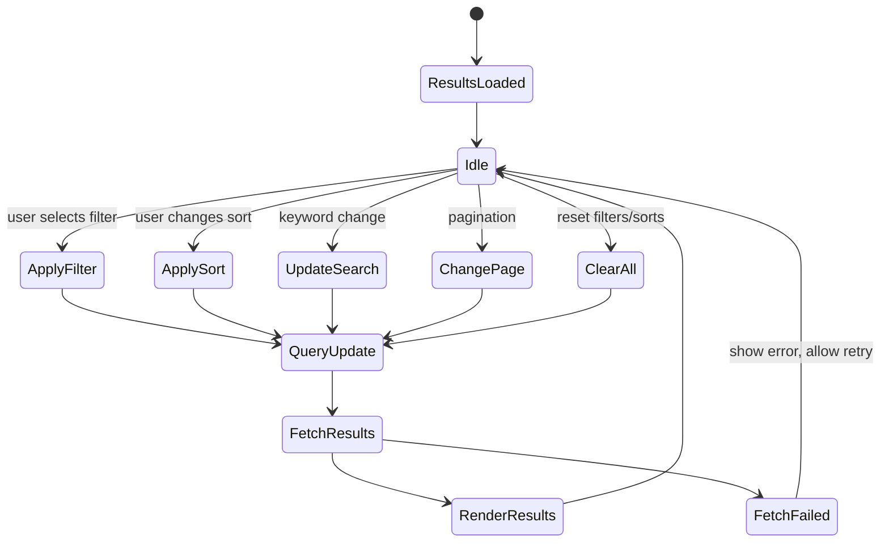
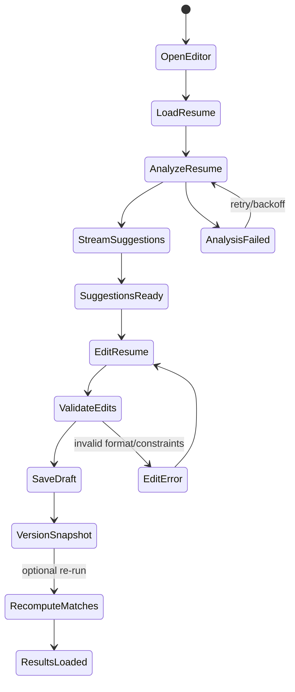

# State Machines

## Resume → Career Matches (Durable + Streaming)

**Notes**
- Durable work begins at `TriggerJobFetch` and continues through `AnalysisRunning`.
- UI renders from a stream (`StreamResults`) instead of polling.
- Failures are retryable where the workflow can safely resume.

## Results Exploration (Filters + Sorts)

**Notes**
- Query state is derived from filters + sort + pagination, not ad-hoc local state.
- Keep the fetch read-only; avoid writing anything during filter/sort changes.

## Resume Improvement (Inline Editing)

**Notes**
- Suggestions can stream into the editor so the user can start editing early.
- Every save creates a snapshot for undo/compare and future scoring.
